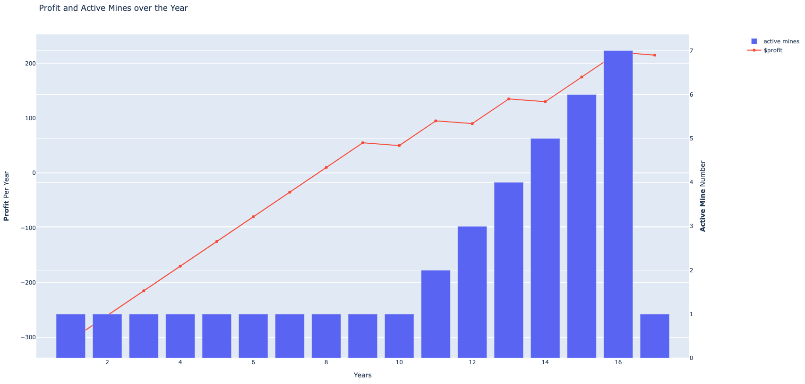

# Mining

## Pre request

- make sure have python3.8 installed

##  

## Install and Run in local

- active the virtual environment:

go to `venv` directory run following command:

```
source ./venv/bin/activate
```

- install

```
python3 install -r requirements.txt
```

- find `mining.py` file

```
python3 mining.py
```

This will print out on each year, the profit, number of total mines and active ones. You need to change the default
value to see different result.

## Strategy

- maximum profit

open 1 mine at a time, keep the minimum number of operation cost, only open a new one when the existing mine reaches
maximum life.
**uncomment below code to activate this strategy**

```
if self.count_available_mines(mines) == 0:
```

- minimum time

using minimum time. When there is reserved mineral left and current profit
  can afford a new mine, open a new mine, this will increase the productivity to finish as soon as possible
  **uncomment follow code to activate this strategy(default this is enabled)**

```
if self.count_available_mines(mines) == 0 or total_profit >= self.cost_open_mine:
```

## Example

the example chart is create with following default values

```python
# total reserved mineral(t)
TOTAL_RESERVE = 600
# initial cost to start this mining project
INIT_COST = 300
# cost on opening a new mine
COST_OPEN_MINE = 50
# cost of operation a mine
MAINTAIN_COST = 30
# amount of mineral in ton per year
PRODUCTIVITY = 15
# mineral sale price per ton
PRICE = 5
# time for each mine to operation(year)
LIFE = 10
```



console output:

```shell
Year: 1, profit: -305, total mines: 1, active mines: 1, remain mineral: 585
Year: 2, profit: -260, total mines: 1, active mines: 1, remain mineral: 570
Year: 3, profit: -215, total mines: 1, active mines: 1, remain mineral: 555
Year: 4, profit: -170, total mines: 1, active mines: 1, remain mineral: 540
Year: 5, profit: -125, total mines: 1, active mines: 1, remain mineral: 525
Year: 6, profit: -80, total mines: 1, active mines: 1, remain mineral: 510
Year: 7, profit: -35, total mines: 1, active mines: 1, remain mineral: 495
Year: 8, profit: 10, total mines: 1, active mines: 1, remain mineral: 480
Year: 9, profit: 55, total mines: 1, active mines: 1, remain mineral: 465
create a new mine
Year: 10, profit: 95, total mines: 2, active mines: 1, remain mineral: 435
create a new mine
Year: 11, profit: 135, total mines: 3, active mines: 2, remain mineral: 405
create a new mine
Year: 12, profit: 220, total mines: 4, active mines: 3, remain mineral: 360
create a new mine
Year: 13, profit: 350, total mines: 5, active mines: 4, remain mineral: 300
create a new mine
Year: 14, profit: 525, total mines: 6, active mines: 5, remain mineral: 225
create a new mine
Year: 15, profit: 745, total mines: 7, active mines: 6, remain mineral: 135
create a new mine
Year: 16, profit: 1010, total mines: 8, active mines: 7, remain mineral: 30
create a new mine
Year: 17, profit: 870, total mines: 9, active mines: 1, remain mineral: 0
```
